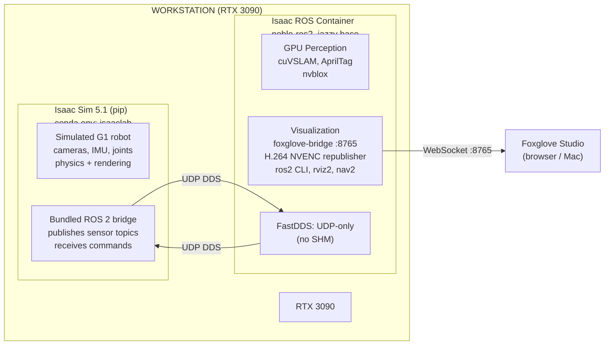
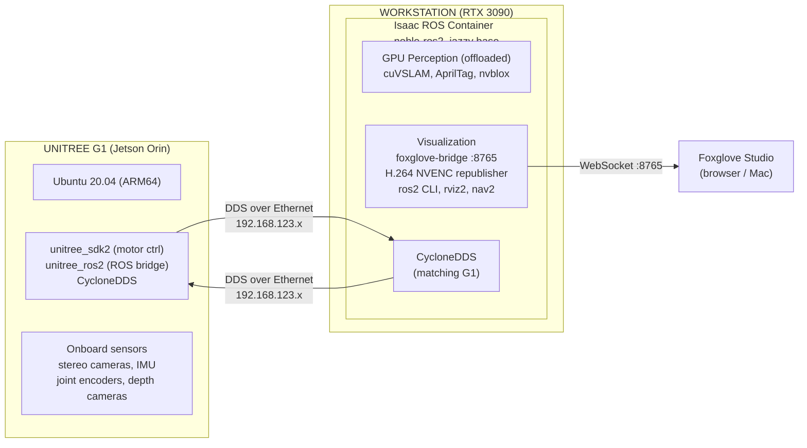

Two modes: **simulation** (Isaac Sim on workstation) and **real robot** (Unitree G1 with Jetson Orin). Both share the same Isaac ROS container on the workstation for GPU perception and visualization.

---

## Simulation Mode



### Data Flow (Sim)

1. Isaac Sim renders scene + simulates physics for G1 robot
2. Bundled ROS 2 bridge publishes camera, IMU, joint state topics via DDS
3. Isaac ROS container receives topics over UDP DDS (FastDDS SHM disabled)
4. GPU perception runs on RTX 3090: SLAM, AprilTag, nvblox
5. H.264 NVENC republisher encodes camera feeds for remote viewing
6. foxglove-bridge exposes all topics over WebSocket on port 8765
7. Foxglove Studio connects from browser (Mac via Tailscale)

### Isaac Lab Training

- Isaac Lab runs headless in the `isaaclab` conda env
- Trains RL policies for G1 locomotion, manipulation
- No Isaac ROS container needed during training (pure sim loop)
- Trained policies deploy to real G1 via `unitree_ros2`

---

## Real Robot Mode



### Data Flow (Real)

1. G1's Orin publishes camera, IMU, joint state topics via CycloneDDS
2. Workstation's Isaac ROS container receives topics over DDS (Ethernet)
3. GPU perception runs on RTX 3090 (offloaded from Orin for heavy tasks)
4. Results published back to G1 over DDS (SLAM pose, detections, maps)
5. foxglove-bridge + H.264 republisher provide remote visualization
6. Foxglove Studio connects from browser

### G1 Network Topology

| Device | IP | Role |
|---|---|---|
| Development PC (workstation) | 192.168.123.99 | Isaac ROS container, visualization |
| G1 internal RockChip | 192.168.123.161 | Low-level motor control |
| G1 internal Orin | 192.168.123.164 | High-level control, sensors, ROS 2 |

### G1 ROS 2 Topics

| Topic | Type | Direction |
|---|---|---|
| `/lowstate` | `unitree_hg::LowState` | G1 -> workstation |
| `/lowcmd` | `unitree_hg::LowCmd` | workstation -> G1 |
| `/api/sport/request` | High-level motion | workstation -> G1 |
| Camera topics | `sensor_msgs/Image` | G1 -> workstation |
| IMU topics | `sensor_msgs/Imu` | G1 -> workstation |

### DDS Configuration

G1 uses CycloneDDS (not FastDDS). Set in the Isaac ROS container:

```bash
export RMW_IMPLEMENTATION=rmw_cyclonedds_cpp
export CYCLONEDDS_URI='<CycloneDDS><Domain><General><Interfaces>
  <NetworkInterface name="eth0" priority="default" multicast="default"/>
</Interfaces></General></Domain></CycloneDDS>'
```

`ros2_jazzy` base image ships with `rmw_cyclonedds_cpp` pre-installed.

### Orin vs Workstation GPU Perception

The G1's Orin can run Isaac ROS perception locally, but the RTX 3090 is far more powerful.

| Workload | Location | Examples |
|---|---|---|
| Heavy perception | Workstation (RTX 3090) | SLAM, nvblox, large model inference |
| Latency-critical | Orin (final deployment) | Obstacle detection, emergency stop |

During development, run everything on workstation.

---

## Isaac ROS Container -- What's Inside

### Base: Full NVIDIA Image

```
nvcr.io/nvidia/isaac/ros:noble-ros2_jazzy_<hash>-amd64
```

Includes ROS 2 Jazzy (50+ packages), TensorRT, PyTorch, nav2, rviz2, foxglove-bridge, slam_toolbox, OpenCV, CUDA dev tools, VPI, CV-CUDA, and Triton.

### Custom Dockerfile Additions

| Package | Purpose |
|---|---|
| `ros-jazzy-isaac-ros-apriltag` | GPU AprilTag detection |
| `ros-jazzy-isaac-ros-visual-slam` | cuVSLAM |
| `ros-jazzy-isaac-ros-nvblox` | GPU 3D reconstruction |
| `ros-jazzy-foxglove-compressed-video-transport` | H.264 NVENC for Foxglove |
| `ros-jazzy-ffmpeg-encoder-decoder` | ffmpeg NVENC support |
| `ffmpeg` | CLI tool |
| FastDDS no-SHM XML | Fix SHM transport for sim mode |
| Entrypoint: `50-foxglove-bridge.sh` | Auto-start foxglove-bridge |
| Entrypoint: `60-h264-republisher.sh` | Auto-start H.264 NVENC republisher |

### What's NOT Needed in the Container

- **Unitree SDK** -- runs on the G1's Orin, not the workstation
- **Unitree ROS 2 packages** -- G1 publishes standard ROS 2 topics, container just subscribes
- **System ROS 2 on host** -- conflicts with Isaac Sim's bundled Python 3.11 rclpy
- **Separate Unitree Docker container** -- G1 is a standard ROS 2 robot from the container's perspective

---

## Unitree Software Stack (Reference)

Runs on the G1, not the workstation.

| Package | Location | Purpose |
|---|---|---|
| `unitree_sdk2` | G1 Orin | C++ SDK for motor control |
| `unitree_sdk2_python` | G1 Orin | Python bindings via pybind11 |
| `unitree_ros2` | G1 Orin | ROS 2 bridge (publishes topics) |
| CycloneDDS 0.10.2+ | G1 Orin | DDS middleware |

### Simulation Equivalents

| Real | Simulated |
|---|---|
| `unitree_ros2` on Orin | Isaac Sim's bundled ROS 2 bridge |
| Physical sensors | Simulated cameras/IMU in Isaac Sim |
| `unitree_sdk2` motor control | Isaac Sim physics engine |
| G1 USD model | `unitree_sim_isaaclab` or Isaac Lab `g1.usd` |

### Key Repos

- [unitreerobotics/unitree_ros2](https://github.com/unitreerobotics/unitree_ros2)
- [unitreerobotics/unitree_sdk2](https://github.com/unitreerobotics/unitree_sdk2)
- [unitreerobotics/unitree_sim_isaaclab](https://github.com/unitreerobotics/unitree_sim_isaaclab)
- [unitreerobotics/unitree_rl_lab](https://github.com/unitreerobotics/unitree_rl_lab)
