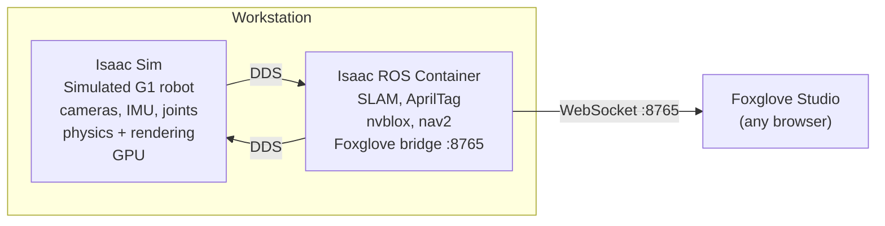

Robotics simulation and perception stack for the **Unitree G1 humanoid robot**. Start here if ROS, Isaac Sim, or Docker are new to you.

## What this system does

Develop software for a bipedal humanoid robot (Unitree G1) that walks, sees, and interacts with its environment. Two modes:

| Mode | What's running | Where |
|---|---|---|
| **Simulation** | A virtual G1 in a physics simulator | Workstation (RTX 3090) |
| **Real robot** | Physical G1 with cameras, IMU, motors | G1's onboard Jetson Orin + workstation for heavy GPU tasks |

Both modes use the same perception pipeline on the workstation.

## The key software

### ROS 2 (Robot Operating System 2)

Middleware framework for robotics. Programs ("nodes") communicate by publishing and subscribing to named data channels ("topics"). A camera node publishes image data on `/camera/image`, a SLAM node subscribes to it.

- **Not an OS** -- a set of libraries and tools that run on Linux
- **DDS** -- transport layer. Nodes discover each other automatically over the network, no central server
- **Version:** Jazzy (latest LTS)

### Isaac Sim

NVIDIA's robot simulator. Renders a 3D world with accurate physics (contacts, gravity, friction) and simulates sensors (cameras, IMU, lidar). The simulated G1 publishes the same ROS 2 topics as the real robot -- downstream code doesn't know the difference.

- Runs on workstation GPU (RTX 3090)
- Launched from a desktop session (needs a display)
- Built-in ROS 2 bridge publishes sensor data

### Isaac ROS

GPU-accelerated ROS 2 packages from NVIDIA for robot perception:

| Package | What it does |
|---|---|
| **cuVSLAM** | Visual SLAM -- builds a map and tracks the robot's position using cameras |
| **AprilTag** | Detects fiducial markers in camera images |
| **nvblox** | Builds a 3D occupancy map from depth cameras |

Run inside a Docker container on the workstation, receiving sensor data from either Isaac Sim (simulation) or the real G1 (over the network).

### Docker

All Isaac ROS packages run in a Docker container -- an isolated Linux environment with its own libraries. Avoids version conflicts with the host system. Full GPU access via `nvidia-container-toolkit`.

### Foxglove

Browser-based visualization tool. Connects to a WebSocket bridge (port 8765) in the Isaac ROS container to display camera feeds, 3D maps, robot state, and sensor data in real time. No install needed -- just open a browser.

## How it all connects

In simulation mode, Isaac Sim replaces the real robot. In real robot mode, the G1's Jetson Orin publishes the same ROS 2 topics over Ethernet instead.

## Accessing the workstation

| Method | Use case | Details |
|---|---|---|
| **Moonlight** | Full desktop (best for Isaac Sim GUI) | Connect via Sunshine streaming server |
| **SSH** | Terminal only | `ssh workstation` (via Tailscale) |
| **Foxglove** | View sensor data from any browser | `ws://workstation:8765` |

All remote access works over [Tailscale](/robot-docs/networking/tailscale/) (mesh VPN) -- no need to be on the same network.

## Where to go next

1. **[Architecture](/robot-docs/architecture/)** -- detailed data flow diagrams for simulation and real robot modes
2. **[Current Setup](/robot-docs/current-setup/)** -- exact software versions and configuration
3. **[Isaac Sim](/robot-docs/isaac-sim/)** -- launching the simulator, ROS 2 bridge, troubleshooting
4. **[Isaac ROS](/robot-docs/isaac-ros/)** -- the Docker container, what's inside, how to use it
5. **[Current Progress](/robot-docs/current-progress/)** -- what's being worked on right now
