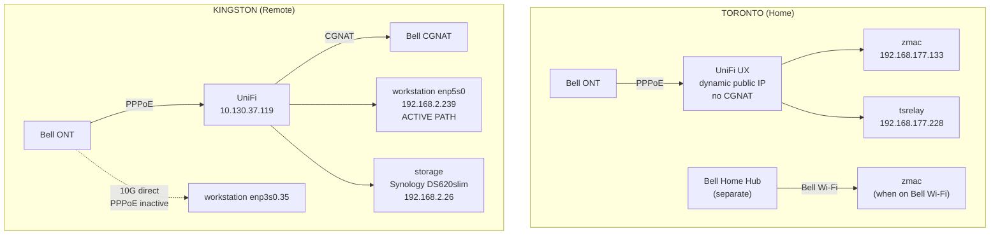

## Locations

### Toronto (Home) -- Primary location

| | |
|---|---|
| **ISP** | Bell Canada via PPPoE |
| **Public IP** | Dynamic via PPPoE (no CGNAT, real public IP) |
| **Router** | UniFi Cloud Gateway Ultra (UX), firmware 4.0.12.17054 |
| **WAN** | PPPoE (`ppp0`) |
| **LAN** | 192.168.177.0/24 (Default network) |
| **UPnP** | Enabled (with NAT-PMP + Secure Mode) |

**Devices:**

| Device | LAN IP | Tailscale IP | Tags |
|---|---|---|---|
| `zmac` (Mac) | 192.168.177.133 | 100.117.222.41 | `tag:clients` |
| `tsrelay` (relay) | 192.168.177.228 | 100.95.40.19 | `tag:relay` |

**Secondary network**: Bell Wi-Fi (separate Bell Home Hub router). More permissive NAT (Endpoint-Independent Filtering). Direct Tailscale connections work without UPnP.

---

### Kingston (Remote) -- Workstation location

| | |
|---|---|
| **ISP** | Virgin Plus (Bell flanker brand) via PPPoE (CGNAT) |
| **Public IP** | CGNAT -- not directly routable |
| **Router** | UniFi |
| **WAN IP from Bell** | 10.130.37.119 (private, confirms CGNAT) |
| **LAN** | 192.168.2.0/24, gateway 192.168.2.1 |

**Workstation:**

| | |
|---|---|
| **Hostname** | `workstation` |
| **LAN IP** | 192.168.2.239 (via enp5s0, 1G) |
| **Tailscale IP** | 100.101.214.44, `tag:clients` |
| **GPU** | NVIDIA RTX 3090 |

Two physical NICs:
- `enp5s0` (1G): Connected to Kingston UniFi, active internet path
- `enp3s0` (10G): Has PPPoE config for Bell on VLAN 35 (`enp3s0.35`). Currently INACTIVE. **Keep PPPoE off** -- stale endpoints confuse Tailscale's hole-punching.

**Other Kingston devices:**

| Device | LAN IP | Tailscale IP |
|---|---|---|
| `workstation-kvm` | -- | 100.67.214.102 |
| `storage` (Synology DS620slim, DSM 7.3.2) | 192.168.2.26 | 100.106.137.64 |

Backup access: Teleport VPN can reach workstation at LAN IP 192.168.2.239 when Tailscale is down.

---

## Network Diagram

---

## Tailscale Devices

| Device | Hostname | Tailscale IP | OS | Tags | Location |
|--------|----------|-------------|-----|------|----------|
| zmac | zeul-mac | 100.117.222.41 | macOS | tag:clients | Toronto |
| tsrelay | tsrelay | 100.95.40.19 | Linux | tag:relay | Toronto |
| workstation | workstation | 100.101.214.44 | Linux | tag:clients | Kingston |
| workstation-kvm | workstation-kvm | 100.67.214.102 | Linux | -- | Kingston |
| zeul-iphone | zeul-iphone | 100.113.247.15 | iOS | -- | Mobile |
| robin-mac | robin-mac | 100.99.96.72 | macOS | -- | Offline |
| robin-iphone | robin-iphone | 100.105.68.71 | iOS | -- | Offline |
| storage | storage | 100.106.137.64 | Linux (DSM 7) | -- | Kingston |

---

## Services Running

### Workstation (Kingston)

- Sunshine (game streaming server)
- Tailscale
- GDM: autologin enabled, Wayland disabled (X11 only for NVIDIA)
- X11: headless with virtual display via xorg.conf MetaModes

### tsrelay (Toronto)

| | |
|---|---|
| **Hardware** | Raspberry Pi 4 Model B Rev 1.4, 8GB RAM, 4-core ARM Cortex-A72 @ 1.8 GHz |
| **Role** | Tailscale peer relay, port 40000 (`--relay-server-port=40000`) |
| **Port forward** | UDP 40000 -> tsrelay on Toronto UniFi |
| **NIC** | Wired gigabit Ethernet (eth0) |

---

## Throughput Benchmarks (Tailscale Direct, Feb 2026)

### Pi (wired) to Workstation

| Direction | TCP (single) | TCP (4 streams) | UDP ceiling |
|-----------|-------------|-----------------|-------------|
| Pi to WS (upload) | 434 Mbps | -- | 323+ Mbps (0% loss at 500M) |
| WS to Pi (download) | 119 Mbps | 248 Mbps | ~260 Mbps (drops above) |

### Mac (Wi-Fi) to Workstation

| Direction | TCP (single) |
|-----------|-------------|
| Mac to WS | 109 Mbps |
| WS to Mac | 81 Mbps |

### Raw ISP speeds (Ookla)

| Location | To Bell server | To Rogers (cross-network) |
|----------|---------------|--------------------------|
| Kingston (WS) | 896 down / 342 up Mbps | 99 down / 212 up Mbps |
| Toronto (Pi) | Not tested | Not tested |

### Bottlenecks

1. **Kingston CGNAT outbound**: Hard packet drops above ~260 Mbps. Cross-network speeds drop significantly vs Bell-internal tests.
2. **Mac Wi-Fi**: Caps at ~250 Mbps LAN, further reduced through WireGuard to ~80-109 Mbps. Wired connection fixes this.
3. **Tailscale MTU 1280**: More packets per byte, higher overhead.
